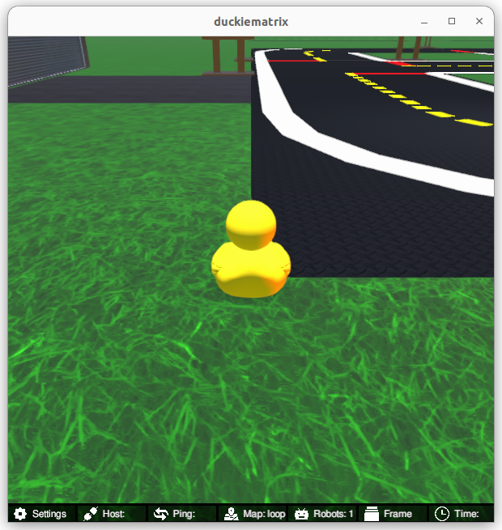
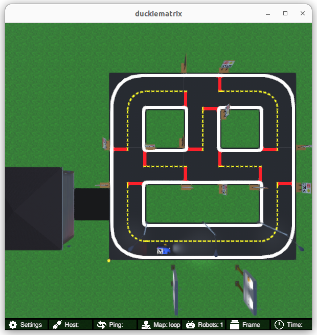

# **Learning Experience (LX): ROS Basics**

# About these activities

In this learning experience, you will learn the basics of [ROS (Robot Operating System)](https://ros.org/).

This learning experience is provided by Duckietown in collaboration with 
[Prof. Romulo Meira-Goes, Ph.D](https://www.eecs.psu.edu/departments/directory-detail-g.aspx?q=rzm5911) 
(Pennsylvania State University). Visit the 
[Duckietown Website](https://www.duckietown.com) for more learning materials, documentation, and demos.


# Instructions

**NOTE:** All commands below are intended to be executed from the root directory of this exercise (i.e., the directory containing this README).

The recommended way to use this repository is to make a fork and then clone that fork. This can be done through
the github web interface. However, you are also free to simply clone this repository and get started. 

This exercise can be run on a real Duckiebot or on a virtual Duckiebot in the Duckiematrix. 

## 1. Make sure your exercise is up-to-date

In case your instructor has updated something in this repo, you should make sure everything is up to date (this assumes
that you created a fork):

    git remote add upstream git@github.com:duckietown/lx-ros-basics
    git pull upstream <branch>

**NOTE:** Example instructions to fork a repository and configure to pull from upstream can be found in the 
[duckietown-lx repository README](https://github.com/duckietown/duckietown-lx/blob/mooc2022/README.md).


## 2. Make sure your system is up-to-date

- 💻 Always make sure your Duckietown Shell is updated to the latest version. See [installation instructions](https://github.com/duckietown/duckietown-shell)

- 💻 Update the shell commands: `dts update`

- 💻 Update your laptop/desktop: `dts desktop update`

- 🚙 Update your Duckiebot: `dts duckiebot update ROBOTNAME`
(where `ROBOTNAME` is the name of your Duckiebot - real or virtual.)


## 3. Work on the exercise

### Launch the code editor

Open the code editor by running the following command,

```
dts code editor
```

Wait for a URL to appear on the terminal, then click on it or copy-paste it in the address bar
of your browser to access the code editor. The first thing you will see in the code editor is
this same document, you can continue there.


### Walkthrough of notebooks

**NOTE**: You should be reading this from inside the code editor in your browser.

Inside the code editor, use the navigator sidebar on the left-hand side to navigate to the
`notebooks` directory and open the first notebook.

Follow the instructions on the notebook and work through the notebooks in sequence.


### Testing with the Duckiematrix

In order to test your code in the Duckiematrix you will need a virtual robot. You can create one with the command:

```
dts duckiebot virtual create [VBOT]
```

where `[VBOT]` can be anything you like (but remember it for later).

Then you can start your virtual robot with the command:

```
dts duckiebot virtual start [VBOT]
```

You should see it with a status `Booting` and finally `Ready` if you look at `dts fleet discover`: 

```
     | Hardware |   Type    | Model |  Status  | Hostname 
---  | -------- | --------- | ----- | -------- | ---------
[VBOT] |  virtual | duckiebot | DB21J |  Ready   | [VBOT].local
```

Now that your virtual robot is ready you can start the Duckiematrix. From this exercise directory do:

```
dts code start_matrix
```

You should see the Unity-based Duckiematrix simulator start up. The startup screen will look like:



From here you can click anywhere on the window and click [ENTER] to make it become active. From here you can move the duckie towards the Duckiebot with the 'w', 'a', 's', and 'd' keys or you can move the camera angle to view the Duckiebot with the mouse. Alternately, you can change to an overhead view be pressing 'v' which will give you a view that looks like this:




### Build the Code

You can build the code with 

```
dts code build -R ROBOTNAME
```

where ROBOTNAME can be either a real or virtual robot. 

###  Testing the code

Then you may run your code with 

    $ dts code workbench -R ROBOTNAME [-m]

where ROBOTNAME can be either a real or virtual robot, but if it is a virtual robot you should include the `-m` option
to indicate that you want to test it in the Duckiematrix. 
